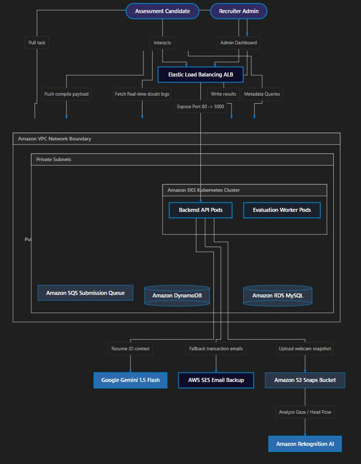
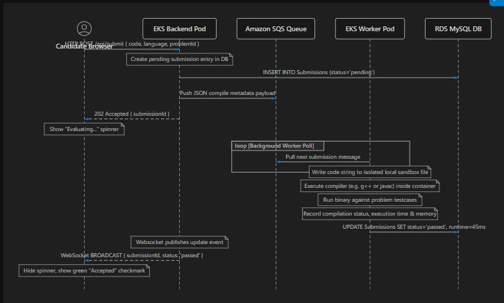
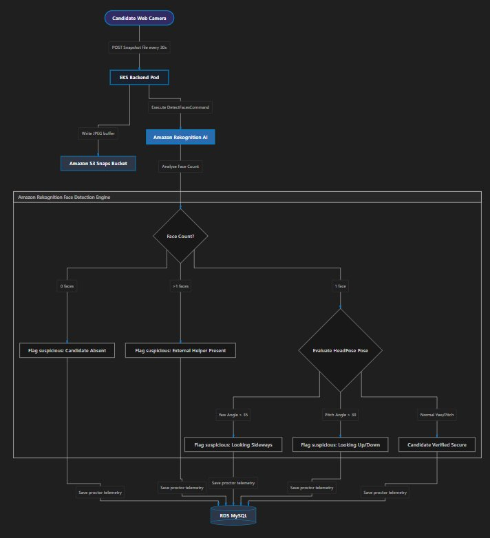
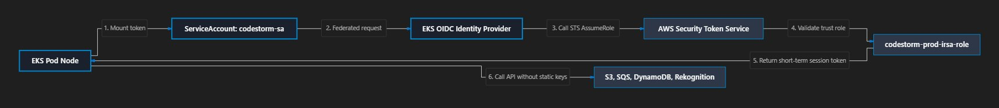

# CodeStorm

A distributed, high-performance coding assessment and interview preparation platform — built for recruiters and candidates alike. CodeStorm combines live coding contests, 1:1 mock interviews, crowdsourced interview prep, AI resume matching, and AI-powered proctoring, all running on a secure, auto-scaling AWS/Kubernetes backend.

> 🎥 **Live demo:** AWS infrastructure is currently spun down to manage cloud costs. [Demo video link here] — redeployable on request via the Terraform/IaC in this repo.

---

## ✨ Features

### 🧠 Interview Preparation Arena
- **Crowdsourced Interview Logs** — candidates share company-specific questions, tagged by difficulty, topic, and role, forming a searchable question bank.
- **Dynamic Doubt Solver Forum** — a live Q&A thread on every shared log; replies broadcast instantly via Socket.io.
- **NoSQL Notification Pipeline** — a DynamoDB-backed service that fires real-time WebSocket alerts (`doubt_received`, `reply_received`) so candidates never miss a response.

### 🏆 Contest Execution & Evaluation Engine
- **Monaco Code Editor** — in-browser IDE with auto-completion and multi-language support (C++, Java, Python, JavaScript).
- **Asynchronous Sandbox Queue Processing** — submissions are decoupled from the API via Amazon SQS; isolated worker containers compile, run, and grade code under strict CPU/memory limits, then write results back.
- **Real-Time Scoreboards** — evaluation events trigger WebSocket broadcasts, updating leaderboards and rankings live with zero page refreshes.

### 📄 AI Resume Matcher & Optimizer
- Candidates upload a resume (PDF) and a target job description.
- **Google Gemini 1.5 Flash** performs semantic matching against the role and returns a structured JSON response: a 0–100 match score, matched/missing skills, strengths, and improvement suggestions.
- **Bullet Point Optimizer** — renders side-by-side "original vs. AI-optimized" resume lines to make accomplishments more metric-driven.

### 🛡️ Automated AI Proctoring & Security
- **Client-side event tracing** — detects tab switches, copy-paste attempts, and external links, syncing violation counts to the server in real time.
- **Amazon Rekognition Vision Analytics** — periodic webcam snapshots are analyzed for face presence, multiple-person detection, and head pose (pitch/yaw) to flag suspicious behavior during exams.

### 👥 Live Collaborative Interview Arena
- **Real-time collaborative code editor** — synchronizes keystrokes between interviewer and candidate over WebSockets for smooth pair programming.
- **Shared whiteboard** — an HTML5 canvas for sketching system designs and architecture diagrams together, live.

---

## 🏗️ Tech Stack

| Layer | Technology |
|---|---|
| Frontend | React, Monaco Editor, Socket.io client |
| Backend | Node.js, Express, WebSockets |
| Async Processing | Amazon SQS + containerized sandbox workers |
| Database | Amazon RDS (MySQL), Amazon DynamoDB |
| AI/ML | Google Gemini 1.5 Flash, Amazon Rekognition |
| Storage | Amazon S3 (SSE-KMS encrypted) |
| Infra & Orchestration | Docker, Amazon EKS (Kubernetes), Terraform |
| CI/CD | GitHub Actions, Amazon ECR, GitOps |
| Security | AWS KMS (envelope encryption), IAM IRSA (OIDC federation) |

CodeStorm integrates **13 core AWS services** end-to-end across compute, storage, messaging, and AI.

---

## 🖼️ System Architecture

### High-Level Cloud Architecture
End-to-end topology — from candidate/recruiter entry points through the Elastic Load Balancer into the EKS cluster, fanning out to SQS, DynamoDB, RDS, S3, SES, Gemini, and Rekognition.



### Asynchronous Code Execution Pipeline
When a candidate submits code: the API writes a pending entry to RDS, pushes a payload to SQS, and returns `202 Accepted` immediately. A worker pod polls SQS, executes the code in an isolated sandbox, and broadcasts the result back over WebSocket.



### AI Gaze & Webcam Proctoring Pipeline
Webcam snapshots are captured every 30 seconds, routed through S3 to Amazon Rekognition, which evaluates face count and head pose (yaw/pitch) to flag absence, external helpers, or abnormal gaze — with all telemetry persisted to RDS.



### Zero-Trust Security (IRSA Flow)
EKS pods mount a service account token that federates through the OIDC Identity Provider to AWS STS, which returns a short-lived session token — allowing pods to call S3, SQS, DynamoDB, and Rekognition with **no static credentials** ever stored in config files.



---

## 🔒 Security Highlights

- **AWS KMS envelope encryption** — a Customer-Managed Key (CMK), provisioned via Terraform with automatic rotation, encrypts the S3 submissions bucket, RDS storage volumes, and EKS secrets in etcd.
- **IAM Roles for Service Accounts (IRSA)** — pods authenticate natively with AWS STS via OIDC federation; the `codestorm-prod-irsa-role` grants least-privilege, scoped access to S3, SQS, SES, DynamoDB, and Rekognition — no long-lived AWS keys anywhere in the cluster.

## ⚙️ CI/CD Pipeline

Every push to `main` triggers a GitHub Actions workflow that:
1. Runs the automated test suite
2. Configures AWS credentials via GitHub Secrets
3. Builds Docker images for the API and evaluation-worker services
4. Pushes images to Amazon ECR
5. Updates EKS kubeconfig and applies rolling `kubectl` deployments

This forms a complete GitOps loop — validated code reaches production automatically on merge, with zero-downtime rolling updates.

---

## 🗺️ Roadmap

- [ ] **Multi-Region EKS Clusters** — replicate worker deployments across regions to cut latency for global contests
- [ ] **Auto-Scaling Worker Pools** — Kubernetes HPA scaling sandbox workers based on live SQS queue depth
- [ ] **Full AWS CloudTrail Auditing** — continuous audit trail for KMS key usage and IAM credential assumption

---

## 🚀 Getting Started

> _Add local setup instructions here — env variables, `docker-compose up`, required AWS/Gemini API keys, etc._

```bash
git clone <repo-url>
cd codestorm
# add setup steps
```

---

## 📄 License

_Add license here._

